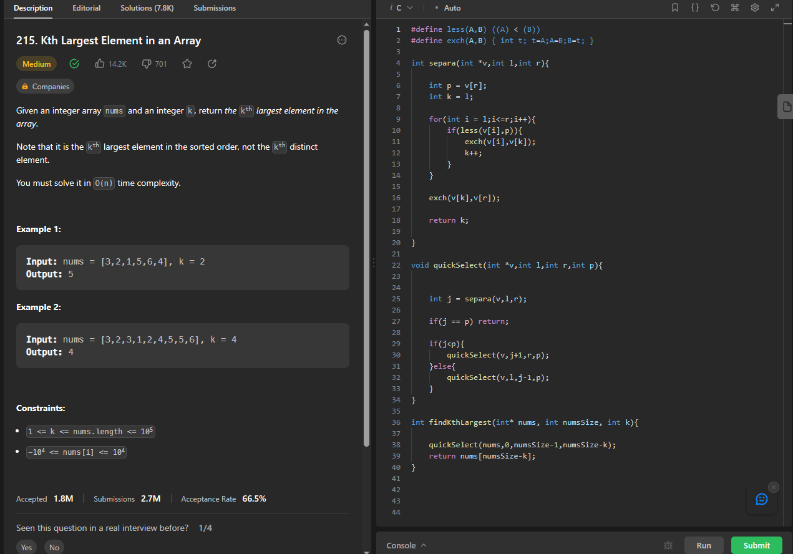
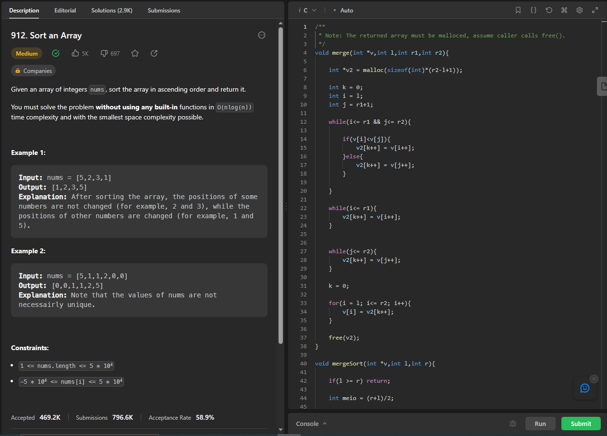
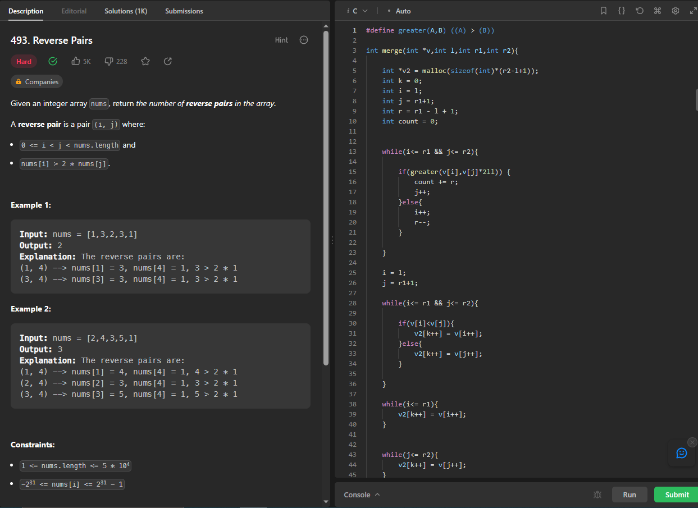

# Exercicios D&C - LeetCode

**Número da Lista**: 4<br>
**Conteúdo da Disciplina**: D&C <br>

## Alunos
|Matrícula | Aluno |
| -- | -- |
| 20/0028677  |  Vitor Manoel Aquino de Brito |


## Sobre 
Este repositório contém a resolução de 4 exercicios relacionados a Algoritmos de divisão e conquista, contemplando os algoritmos mergeSort, quickSelect, e megeSort para contagem de inversões. Os Exercicios realizados foram retirados do [LeetCode](https://leetcode.com/)

## [Link da Apresentação]()

## Screenshots

### Exercicio 1 - Kth Largest Element in an Array

Link: [Kth Largest Element in an Array](https://leetcode.com/problems/kth-largest-element-in-an-array/description/)
Dificuldade: Médio



### Exercício 2 - Sort an Array

Link: [Sort an Array](https://leetcode.com/problems/sort-an-array/description/)
Dificuldade: Médio



### Exercicio 3 -  Reverse Pairs

Link: [Reverse Pairs](https://leetcode.com/problems/reverse-pairs/description/)
Dificuldade: Difícil



## Instalação 
**Linguagem**: C<br>

Caso queira testar localmente é necessário ter o GCC instalado

## Uso 

Para verificar o funcionamento basta abrir o link do exercicio e copiar o código referente a questão, e logo após realizar o envio. Caso queira verificar localmente, é necessário inserir a main com a chamada da função:
```
#include <stdio.h>
#include <stdlib.h>

... //funções principais

int main() {
    printf("%d", nomeDaFuncao(param1,param2,param3)); // ajustar de acordo com a questão
}
```
depois execute o programa, e para isto basta utilizar o comando:

`gcc -o nomeExecutavel nomeArquivo.c`.

